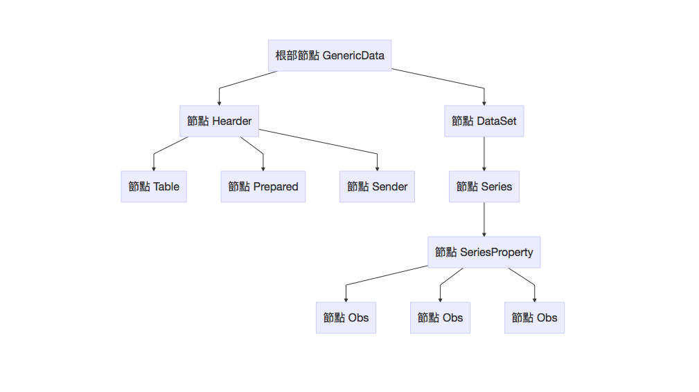

```{r, echo=FALSE, message=FALSE, warning=FALSE}
library(knitr)
knitr::opts_chunk$set(warning=FALSE,message = FALSE)
```

如果你對R／RStudio還不熟，建議閱讀：  
- [R for Data Science](http://r4ds.had.co.nz/index.html)。

如果你對R Markdown, Notebook不熟，可參考：  
- [Getting Started with R Markdown](https://ourcodingclub.github.io/2016/11/24/rmarkdown-1.html)  
- [R Notebook](http://rmarkdown.rstudio.com/r_notebooks.html?version=1.0.143&mode=desktop)  

首先清空環境，再載入這裡所要介紹的 XML 套件。
```{r}
rm(list=ls())
library(XML)
library(xml2)
library(dtplyr)
```

接下來的說明會以[政府資料開放平台](http://data.gov.tw/)裡的[國民所得，民間消費季資料](http://data.gov.tw/node/6802)為範例說，在季資料網頁下，你可以點XML圖示，它會開啟新的網頁並顯現如下的內容。這裡只節錄一小部份，並拿掉前面一開頭的其他非資料內容的程式碼（即`<script>`的部份) 

```
範例XML語法：  
<GenericData>
    <Header>
        <Table Id="NA8203A2Q" Name="民間消費-季" Domain="NA"/>
        <Prepared>2017-05-26T15:39:50.3054985+08:00</Prepared>
        <Sender Name="行政院主計總處">
            <Contact Name="*" Telephone="*" Fax="*" Email="*"/>
        </Sender>
    </Header>
    <DataSet>
        <Series ITEM="當期價格-民間消費合計(新台幣百萬元)">
            <SeriesProperty TableName="民間消費-季" FREQ="" SERIESTYPE="原始值">
                <Obs TIME_PERIOD="1981Q1" OBS_VALUE="237412"/>
                <Obs TIME_PERIOD="1981Q2" OBS_VALUE="217197"/>
                <Obs TIME_PERIOD="1981Q3" OBS_VALUE="240500"/>
```

要了解XML語法，首先要掌握的是  

1. 每個tab都表示往下一層發展的節點。如果將上述範例畫成樹狀圖就會像是：   


2. 每個節點本身可以包含值（Value）或是屬性（Attribute）, 語法差別如下：  
  - 值：`<節點名稱> 值 </節點名稱>`  
    範例：Prepared那個節點包含了什麼值？ 是`2017-05-26T15:39:50.3054985+08:00`，答對了嗎?  
  - 屬性：`<節點名稱 屬性1名稱=屬性值 屬性2名稱=屬性值 />`  
    範例：以下的Obs節點`<Obs TIME_PERIOD="1981Q1" OBS_VALUE="237412"/>`，它包含了什麼屬性？屬性值又為何?   
    它有兩個屬性：第一個屬性叫`TIME_PERIOD`，它的值是`"1981Q1"`；第二個屬性叫`OBS_VALUE`，它的值是`"237412"`，答對了嗎？

接下來我們就可以開始學習XML套件的使用。 

### 壹：xmlTreeParse 讓R了解你在讀xml格式資料

如果我們直接把前面的內容存下來，R可能以為它只是文字字串，我們必需要給它正確的電腦語言詮釋設定（這個動作叫Parsing），電腦才會知道怎麼去理解它。

xmlTreeParse告訴R把內容當作是xml語法來理解。  

```{r, message=FALSE, warning=FALSE}
xml.url <- "http://www.dgbas.gov.tw/public/data/open/Stat/NA/NA8203A2Q.xml"
xmlfile <- xmlTreeParse(xml.url)
```

### 貳：xmlRoot 去蕪存菁原始xml檔案  

原始的xml檔會有很多不必要的資料，如JavaScript等等，我們只想留下最單純的資訊樹狀結構，這時用xmlRoot函數來處理。

```{r, message=FALSE, warning=FALSE}
xmltop = xmlRoot(xmlfile)
```


處理完順便看一下物件類別屬性：  
```{r}
class(xmltop)
```
這裡其中一個屬性`"XMLNode"`是重要的，因為XML套件裡有很多函數只對`XMLNode`物件會起作用。

### 參：認識你的XML節點樹狀結構  

這部份其實在Chrome瀏覽器裡就看得很清楚，但我們還是介紹幾個常用的函數。不過在開始之前，我們有必要複習一下R底下list串列變數的使用方法，因為XMLNode物件是以串列變數方式在記錄訊息的。

- 請學完[「3.4.6、串列」](https://fishchang.gitbooks.io/r-basic/content/3.4.6.html)

###### 例一：使用str( )來檢視xmltop列串的第一層訊息（max.level=1）。  
由樹狀圖我們可預期它是`Header`與`DataSet`兩個節點的訊息。
```{r, message=FALSE, warning=FALSE}
str(xmltop, max.level=1)
```

###### 例二：使用str( )來檢查Header節點的下一層訊息  
對照樹狀圖，希望你有清楚將每個訊息對應到正確的節點位置
```{r, message=FALSE, warning=FALSE}
str(xmltop[[1]],max.level=1)
```

###### 例三：使用str( )來檢查完整xmltop樹狀訊息，即不設定max.level  
不設定max.level會把整棵樹列出來，電腦會跑一陣子。
```{r, eval=FALSE, message=FALSE, warning=FALSE}
str(xmltop)
```

#### 參－1：xmlSize 來計算某一節點往下一層有多少延伸節點

xmltop是以根部節點GenericData開始，所以它的下一層有2個延伸節點（即Header與DataSet）。
```{r}
xmlSize(xmltop)
```


#### 參－2：xmlChildren 裁剪出延伸節點支幹

使用xmlChildren來裁剪出xmltop根部長出的兩根支幹。
```{r, message=FALSE, warning=FALSE}
level1.branch <- xmlChildren(xmltop)
```

這裡level1.branch會是列串變數，第一個元素是Header這個支幹，第二個元素是DataSet這個支幹。

###### 範例1：查看Header支幹
```{r, message=FALSE, warning=FALSE}
level1.branch[[1]]
```

###### 範例2：查看DataSet支幹下一層有多少支節
```{r, message=FALSE, warning=FALSE}
xmlSize(level1.branch[[2]])
```

### 肆：取出節點資訊

#### 肆－1：xmlValue 取出節點值  
【參－2,範例1】我們觀察到`level1.branch[[1]]`底下有一個分枝`Prepared`（是第2個分枝）裡面是有值的，可以取出：
```{r}
xmlValue(level1.branch[[1]][[2]])
```

> 注意：如果分支下面還有很多層分支，它會連更下層分支的值都取回。如果不想取到更下層，可設recursive=FALSE

#### 肆－2：xmlAttrs 查詢節點屬性資訊  

###### 範例1:  
【參－2,範例1】我們觀察到`level1.branch[[1]]`底下有一個分枝`Table`（是第1個分枝）裡面「沒有」值，但「有屬性」。
```{r}
xmlAttrs(level1.branch[[1]][[1]])
```

###### 範例2:   
由level1.branch裡取出DataSet分支下的第一個Series子分枝的屬性資訊。（xmlAttrs只會取指定的那一層，故不需考量recursive設定）
```{r}
xmlAttrs(level1.branch[[2]][[1]])
```

#### 肆－3：xmlGetAttr 取出節點某特定屬性的值  

###### 範例1:  
例用level1.branch取出Header->Table下的Name屬性值。
```{r}
xmlGetAttr(level1.branch[[1]][[1]],"Name")
```

###### 範例2:  
例用level1.branch取出DataSet->(第一個)Series下的ITEM屬性值。
```{r}
xmlGetAttr(level1.branch[[2]][[1]],"ITEM")
```

#### 肆－4：xmlApply 對節點下一層的所有子節點進行相同分析


###### 範例1:  
針對level1.brach來對DataSet取得底下一層39個Series分枝的ITEM屬性值。[資料太長，我們先存在ex4_4.1並用head()只顯示前5筆]
```{r}
ex4_4.1<-xmlApply(level1.branch[[2]],xmlGetAttr,"ITEM")
head(ex4_4.1)
```

###### 範例2:  
針對level1.brach來對DataSet->(第一個)Series->(第一個)SeriesProperty取得底下一層的所有Obs的屬性。[資料太長，我們先存在ex4_4.2並用head()只顯示前5筆]
```{r}
ex4_4.2<-xmlApply(level1.branch[[2]][[1]][[1]],xmlAttrs)
head(ex4_4.2)
```


# Reference
[source1](https://blog.gtwang.org/r/r-xml-package-parsing-and-generating-xml-tutorial/)
[R-Blogger](https://www.r-bloggers.com/)
[初心者](http://molecular-service-science.com/2016/04/07/r-xml-in-practice/)