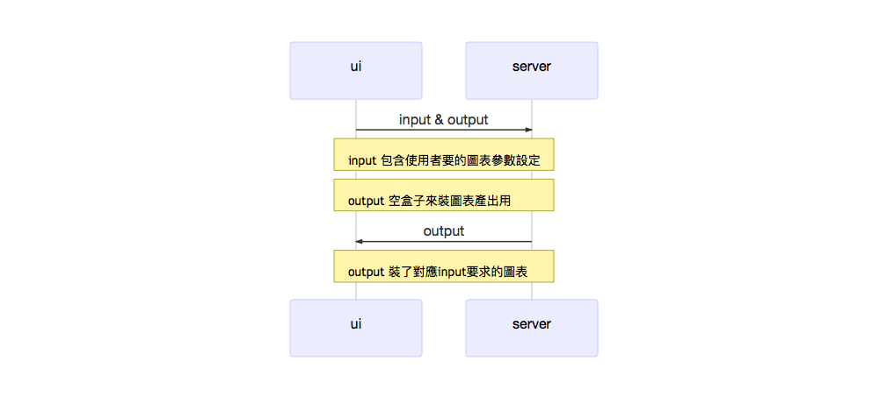
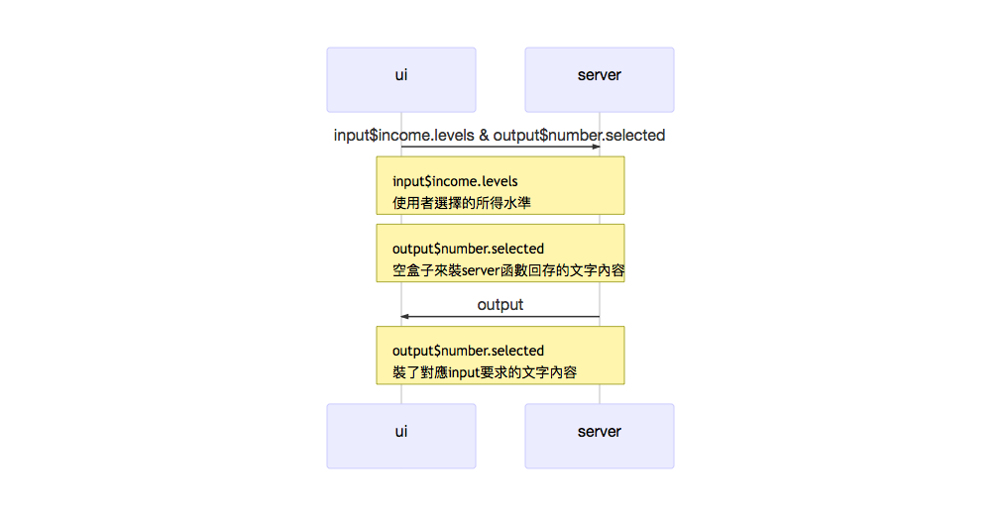

本課程為Shiny互動網頁設計入門

### 背景知識  

以[An Introduction to R](https://github.com/tpemartin/E.Major-IT/raw/Lec11-data-visualization-Shiny/R-intro.pdf)為參考書，完成此課程你必需對以下知識有「基本」了解（只要基本就好）：  

- 如何在R裡寫function (Chapter 10)  
- 如何在R裡做基本的繪圖 (Chapter 12)    
- 理解R裡的列串（list）變數特質 (Chapter 6)  

### 壹：簡介  

Shiny套件能夠幫助你快速地建立一個互動式網頁，不需要擔心不懂網頁語言。

互動網頁基本上是透過使用者介面(user interface, ui)，這裡是網頁瀏覽器，讓使用者輸入參數。這些參數會送到電腦運算，運算完的結果會再傳回到ui讓使用者看。這裡的電腦可以是個人主機或雲端主機，統稱為伺服器server——「伺服」的意思是「伺機」在旁等候呼叫「服務」的意思，所以這個電腦是隨時在注意ui有沒有動作。很明顯的ui會產生input，而server會產生output然後放回ui讓使用者看到結果。

#### 壹－1: ui設計概念

Shiny的ui設計即為網頁設計，而網頁設計時頁面的物件位置有固定位置（Fixed）與流動位置（Fluid）兩大類（混用的則稱為Elastic）——後者比較不會因為每個人螢幕的尺寸不同而產生頁面扭曲、物件錯置；Shiny採流動佈局（Fluid layout）來定義ui上各物件呈現的位置。  

以下是基本ui程式元素  
```
ui<-fluidPage(...)
```
Shiny透過`fluidPage()`產生流動位置佈局的網頁程式碼，R使用者並不太需要會寫網頁程式。  

另外，前面我們說過ui必需要能讓使用者輸入input，且能讓server放回output，故完整ui程式元素如下：  
```
ui<-fluidPage(

  #1. 整體網頁佈局設計
  #2. Input佈局設計
  #3. Output佈局設計

)
```
其中2會產生一個input串列變數，裡頭包含了使用者要的參數設定；3會產生一個圖表空間保留給output串列變數呈現用，同時output串列變數的元素名稱也會在此定義好（只有名稱，沒有內容）。output串列內各元素的內容需要接下來的server，依input參數去產生參數對應圖表物件回填，之後output的圖表內容才會呈現在ui保留的output空間。

想多了解流動佈局：  
- [W3.CSS Responsive Fluid Grid](https://www.w3schools.com/w3css/w3css_grid.asp)


#### 壹－2: server服務內容  

server基本上會去接收ui的input，從input得到參數後，進行計算產生圖表填回去準備好的output串列元素中。  

server程式元素如下:  
```
server<-function(input,output){

  #從input得到參數後，進行計算產生圖表填回去output的程式

}
```

##### ui與server關聯圖


#### 壹－3: 啟動shinyApp

前面兩小節定義好ui及server內容，現在你只需要Shiny幫你把你的R程式轉成網頁語言。透過`shinyApp()`指令，你可以立刻在你電腦看到動態網頁的成品。

執行以下指令立刻在電腦上使用互動網頁成品：  
```
shinyApp(ui=ui,server=server)  
```

### 貳：UI 流動佈局設計

首先要啟動shiny套件：   
```{r}
library(shiny)
```


這節我們進入細部ui流動佈局設計部份，參考資料為：  

- [layout類型](https://shiny.rstudio.com/articles/layout-guide.html)

流動UI佈局裡，頁面設計主要有`sidebarLayout()`與`FluidRow()`兩大類，以下為圖例:

- sidebarLayout() 圖例  
sidebarLayout的UI圖面包含圖形主區塊(main)及使用者輸入的側邊區塊(sidebar)，側邊區塊UI input部份（即圖例上的拉把）只能在左或右。


- FluidRow() 圖例   
較有彈性的調整，但比sidebarLayout複雜。以下我們以sidebarLayout為開始練習。


#### 貳－1: 流動UI設計之sidebarLayout  
還記得在【壹－1】我們說過流動UI設計 （fluidPage）包含了：

1. 整體網頁佈局設計
2. Input佈局設計
3. Output佈局設計

目前「1. 整體網頁佈局設計」部份，我們只先介紹定義整個UI介面大標題的`titlePanel()`。剩下的2跟3是由sidebarLayout來控制，也就是說這兩部份是涵蓋在sidebarLayout()函數裡頭。另外，

sidebarLayout設計顧名思義，其UI頁面會分成主(main)區塊與側邊(sidebar)區塊，分別由`mainPanel()`與`sidebarPanel()`兩個函數來掌控——其中sidebarPanel負責Input部份，而mainPanel負責Output部份。因此使用sidebarLayout的UI流動佈局設計大致可以表示成如下的程式： 
```
ui<-fluidPage(

  titlePanel("1.整體網頁佈局設計：大標題"),
  
  sidebarLayout(
    sidebarPanel(
       2. Input佈局設計
    ),
    mainPanel(
       3. Output佈局設計
    )
  )
)
```

另外，

##### 貳－1-1: sidebarLayout-sidebarPanel之UI input設計
Shiny提供了很多的輸入介面（UI inputs）模式可供選擇：  
- [Shiny widgets gallery](https://shiny.rstudio.com/gallery/widget-gallery.html)裡的
每個介面使用者均可以自由操作看看，底下的`Current Values`告訴你不同選擇下，此輸入介面會傳給server什麼樣的值。

這裡我們選擇使用`Checkbox Group`當例子，它允許使用者有複選可能，如果點它下方的`See Code`，我們會得知產生Checkbox Group所要使用的函數為： 
```
checkboxGroupInput(inputId, label, choices, selected = NULL)
```
##### 範例一：
- UI介面大標題titlePanel為： "不同所得家庭水準所面對的物價指數變化"  

- sidebarLayout的Input佈局設計使用checkboxGroupInput：  
  使用者可以從以下三個選項複選： "最低20%","中間60%","最高20%；  而每個選項傳給server的值分別會是數字：1,2,3；另外，預設選擇是只選1,3選項（即最低及最高20%）。  

以下為程式寫法：
```
ui<-fluidPage(
  # 1.整體網頁佈局設計：大標題
  titlePanel("不同所得家庭水準所面對的物價指數變化"), 
  
  sidebarLayout(
    # 2. Input佈局設計：使用checkboxGroupInput
    sidebarPanel(
      checkboxGroupInput("income.levels",
                          label="請選擇所得水準",
                          choices=list("最低20%"=1,"中間60%"=2,"最高20%"=3),
                          selected=c(1,3)),
    ),
    mainPanel(
      # 3. Output佈局設計
    )
  )
)
```
這個程式會產生一個Input介面，在這介面，使用者會看到一個選項說明"請選擇所得水準"（label），底下會有"最低20%","中間60%","最高20%"，三個格子可勾選（choices），其中使用者不知道的是這三個選項對電腦來說只會視選擇結果記下input值1，2，3（在choices裡定義），而不是記下它的文字定義。另外,selected定義了在使用者還沒開始選時,"最低20%"及"最高20%"已被預選。至於"income.levels"，它表示使用者選完的input結果值會被記錄在一個名叫income.evels的變數裡。

> 基本上所有的Input佈局函數的第一個要素都是記錄UI input值的變數名稱定義（即函數說明的inputId）。

#### 貳－1-2: sidebarLayout-mainPanel之UI output設計

mainPanel裡要定義由【貳－1-1】的UI input你希望產生什麼樣的output，稱之為UI output。Shiny裡的UI output選擇可詳閱以下連結裡的UI Outputs部份：   
- [Shiny reference](https://shiny.rstudio.com/reference/shiny/latest/)  

我們先從`textOutput()`這個UI output函數介紹起，顧名思義，它會在主區塊呈現文字結果。

##### 範例二：延續[範例一]，我們希望mainPanel會顯示使用者選項的對應數值。  
這裡我們可以使用[textOutput](https://shiny.rstudio.com/reference/shiny/latest/textOutput.html), 用法如下： 
```{r}
ui<-fluidPage(
  # 1.整體網頁佈局設計：大標題
  titlePanel("不同所得家庭水準所面對的物價指數變化"),
  
  sidebarLayout(
    sidebarPanel(
      # 2. Input佈局設計：使用checkboxGroupInput
      checkboxGroupInput("income.levels",
                          label="請選擇所得水準",
                          choices=list("最低20%"=1,"中間60%"=2,"最高20%"=3),
                          selected=c(1,3))
      ),   
    mainPanel(
      # 3. Output佈局設計：使用textOutput
      textOutput("number.selected")
      )
  )
)
```
這裡"number.selected"是說，所要呈現的文字得從number.selected這裡變數取出來，至於這個變數內容是怎麼產生的，這部份是server的功作，UI介面只是先準備好一個叫number.selected的變數(目前是空的)，之後UI會把income.levels變數(內容在記錄使用者的選擇)及number.selected變數都傳給接下來要講的server函數，server函數依據income.levels內容作相對應的運算後，會把結果存在number.selected變數裡，再丟回去給UI函數在主區塊呈現結果。

### 參：Server運算函數

依據定義，下圖表示範例中ui-server間的互動：   


由圖中，我們知道server function會運作如下：  
```
server <- function(input,output){
  
  output$number.selected <- {一堆程式列，可使用input$number.selected參數, 來產生東西}  

}
```

Shiny的server回存部份 (即這裡的`output$number.selected <- `)依ui－mainPanel()裡所使用的UI output函數不同而不同。在server函數裡回存函數稱為Rendering functions，可參見reference裡的Rendering functions部份：  

- [Shiny reference](https://shiny.rstudio.com/reference/shiny/latest/)  

依據同樣reference裡對UI inputs::textOutput裡的Details說明，我們會使用Rendering functions::renderText函數。  

##### 範例三: 將input$income.levels的結果以文字方式存在output$number.selected裡。  
在過去如果只是直接把input$income.levels要存在output$number.selected，我們只需要寫：  
```
output$number.selected <- input$income.levels
```
但依Shiny使用方式，我們必需要透過`renderText()`函數，使用法為：   
```
output$number.selected <- renderText(
  {
    產生output$selected所需要的所有程式列
  }
  )
```
這裡需要的程式列只有 input$income.levels一行，所以server函數會寫成如下： 
```{r}
server <- function(input, output) {
  output$number.selected <- renderText(
    {
      input$income.levels
      }
    )
}
```

### 肆：啟動完整UI-Server應用程式  
一旦ui函數及server函數都設定完後，使用下列程式執行此互動網頁應用程式：  
```{r}
shinyApp(ui=ui,server=server)
```

這個簡單的Shiny範例其實相當好用，可用來檢查UI input是否真的產生我們想要的input形式與內容給server，即使server需要做的是繪圖，但先檢查所需繪圖參數是否是你要的形式，可以減少之後的繪圖錯誤。

### 課後練習  
請由[Widgets gallery](https://shiny.rstudio.com/gallery/widget-gallery.html)設計一個UI-sidebarLayout介面， 在sidebarPanel部份包含Date range用來設定住宿起迄日期及Slider range用來設定可接受平均每晚房價(千元)範圍，之後server函數會回傳UI-mainPanel文字結果，顯示輸入結果。 完成練習後，請以此檔名再加你的名字送出pull request。 [hint: sidebarPanel裡可以加不只一個UI input，只要用逗號分隔好就好] 

### Reference  
[Application UI layout guide](https://shiny.rstudio.com/articles/layout-guide.html)

[Shiny tutorial 1](http://shiny.rstudio.com/tutorial/lesson1/)  

[Shiny tutorial 2: build ui](http://shiny.rstudio.com/tutorial/lesson2/)

[Shiny reference](https://shiny.rstudio.com/reference/shiny/latest/)  
  - See UI inputs and UI outputs for UI layout

[Shiny tutorial from RStudio](https://shiny.rstudio.com/tutorial/)

[Explore ggplot2 with Shiny](https://www.r-bloggers.com/shiny-app-to-explore-ggplot2/)   

[Show me Shiny](https://www.showmeshiny.com/category/visualization/ggplot2/)  
