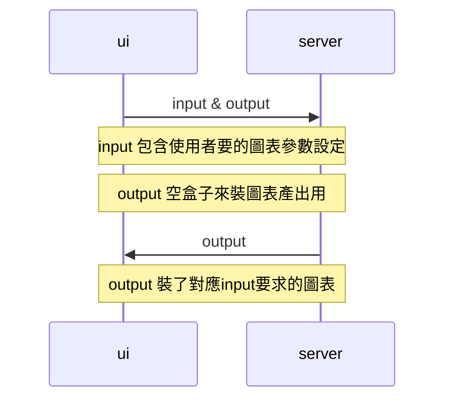

```mermaid
sequenceDiagram
ui->>server: input & output  
  Note over ui,server: input 包含使用者要的圖表參數設定  
  Note over ui,server: output 空盒子來裝圖表產出用
server->>ui: output
  Note over ui,server: output 裝了對應input要求的圖表     
```
