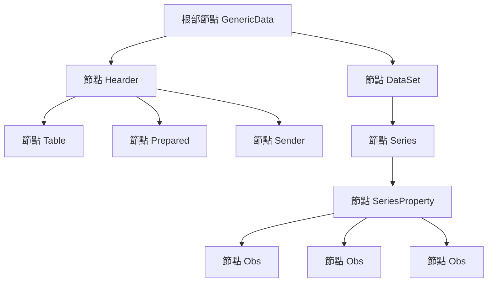

```mermaid
graph TB
root[根部節點 GenericData]-->ch1[節點 Hearder]
root-->ch2[節點 DataSet]
ch1-->ch1.1[節點 Table]
ch1-->ch1.2[節點 Prepared]
ch1-->ch1.3[節點 Sender]
ch2-->ch2.1[節點 Series]
ch2.1-->ch2.1.1[節點 SeriesProperty]
ch2.1.1-->ch2.1.1.1[節點 Obs]
ch2.1.1-->ch2.1.1.2[節點 Obs]
ch2.1.1-->ch2.1.1.3[節點 Obs]
```