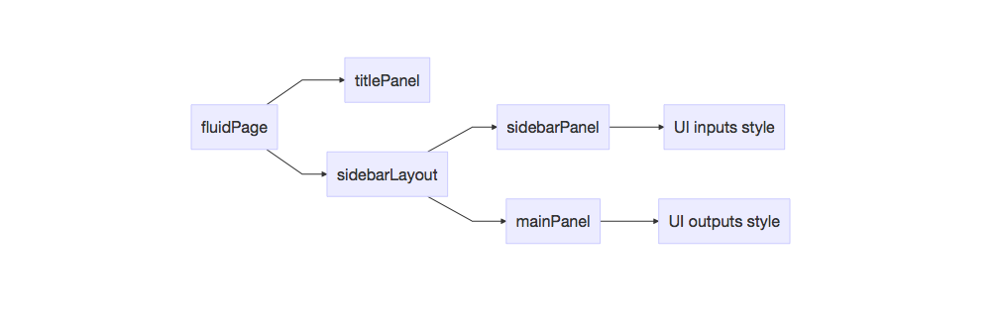

在Part I我們學到Shiny底下的UI流動佈局設計概念，由它來接收使用者的input並準備好空箱子output由接下來要進一步介紹的server函數來回填所要視覺資訊，再回傳UI呈現在網頁上。

```{r, echo=FALSE, message=FALSE, warning=FALSE}
library(knitr)
knitr::opts_chunk$set(warning=FALSE,message = FALSE)
```

### 前情提要

- 請先完成[Part I課程](https://github.com/tpemartin/Teaching-Data-Visualization/blob/master/Rmd/Lec11-data-visualization-Shiny.Rmd)  

在該課程，我們學到設計UI流動部局fluidPage時，我們可以在裡頭設定頁面大標題titlePanel，同時選擇使用sidebarLayout的方式，來定義UI inputs（即使用者選擇參數）和UI outputs（即回傳圖表格式）。其中，sidebarLayout底下的側邊區塊sidebarPanel是用來定義UI inputs，而主區塊mainPanel則是用來定義UI outputs。

Shiny提供了豐富的UI inputs及UI outputs格式選擇：   

- [UI inputs style](https://shiny.rstudio.com/gallery/widget-gallery.html)  
- [UI outputs style, 見連結UI outputs部份](https://shiny.rstudio.com/reference/shiny/latest/)

下圖為UI對應層狀結構： 


### 壹：UI流動佈局fluidPage

我們延伸先前的範例，UI inputs格式使用`checkboxGroupInput`，但和之前不同的是UI outputs格式我們選擇`plotlyOutput`。此外，
  
> `plotlyOutput`並不是Shiny套件包含的UI inputs格式函數，而是由plotly套作提供，所以使用前要記得先library(plotly)

```{r, echo=FALSE, message=FALSE, warning=FALSE}
rm(list=ls())
library(shiny)
library(plotly)
library(dplyr)
library(magrittr)
```

  
下圖為對應前言結構的範例圖，由此程式塊可以得知，在稍後介紹的server函數裡，

> 我們可以用`input$incLevels`來取得使用者的選擇結果，依照此結果，server必需產生對應的plotly圖形回存到`output$income.selected`裡。  

讀者有看到"incLevels"及"income.selected"字眼出現的位罝嗎？它們分別是UI input函數及UI output函數的【第一個】定義元素，決定了server要怎麼用input及output變數——相當重要，別忘了定義它們。

```{r ui, message=FALSE, warning=FALSE}
ui<-fluidPage(
  # 1.整體網頁佈局設計：大標題
  titlePanel("不同所得家庭水準所面對的物價指數變化"),
  
  sidebarLayout(
    sidebarPanel(
      # 2. Input佈局設計：使用checkboxGroupInput
      checkboxGroupInput("incLevels",
                          label="請選擇所得水準",
                          choices=c("最低20％","中間60％","最高20％"),
                          selected=c("最低20％","中間60％","最高20％"))
      ),   
    mainPanel(
      # 3. Output佈局設計：使用plotlyOutput
      plotlyOutput("income.selected")
      )
  )
)
```

### 貳：server函數設計  

[Plotly Shiny Gallery](https://plot.ly/r/shiny-gallery/)

由UI output格式選擇，表示我們的依據`input$incLevels`的內容來使用plotly繪出所要的圖：

##### 範例一：令input$incLevels=c("最低20％","中間60％") 畫出對應的plotly圖形
先引入資料
```{r}
load("./data/cpiByHouseholdIncome.Rda")
```
查看dataframe
```{r, results="asis"}
cpiByHouseholdIncome %>% head %>% kable
```
這裡變數income.level前6筆只有"最低20％"，但其實全部有三種："最低20％","中間60％","最高20％"。 

#### 貳－1：server情境設計  
了解資料內容後，首先要做的是寫一段程式來試試看，在某個input情境下，如何產生對的output要求。我們要先𨤳清：  

-  input情境的定義  
-  什麼是對的output要求  


##### 範例一（延續）：input情境定義  
假設在UI inputs下，使用者選了"最低20％"及"中間60％"兩類。依據此情境及【第一節】的UI設計，我們知道它代表了如下的input參數設定:  
```{r, message=FALSE, warning=FALSE}
input<-list() #先宣告一個名為input的串列變數
input$incLevels <- c("最低20％","中間60％") #在input串列裡加一個元素incLevels，並定義情境內容
```

##### 範例一（延續）：對的output要求  
由於UI的output格式函數是plotlyOutput，所以我們要寫一段程式：在給定上面的`input$incLevels`之後，我們要產生一個plotly圖形（因為我們使用了plotlyOutput），這個圖形以上述情況設定必需是"最低20％"及"中間60％"兩類家庭所面對cpi之時間趨勢圖。

【Plotly程式塊】
```{r, message=FALSE, warning=FALSE}
# 選出資料中符合使用者要求家庭所得水準的資料，存成subset.data
cpiByHouseholdIncome %>%
  filter(income.level %in% input$incLevels)->subset.data

# 從subset.data取出每一所得水準的最後一筆物價指數值（之後要放圖標annotations用）
subset.data %>%
  group_by(income.level) %>%
  summarise(last.cpi=last(cpi)) -> last.y.value

# 使用subset.data繪圖，其中用顏色來區分資料所得水準類別：圖存成p
subset.data %>%
  plot_ly(x=~時間,y=~cpi,color=~income.level) %>%
  add_lines
```

### 貳－2：組合出server函數
一旦我們可以在設定情境定畫出對的output要求, 我們只需要依以下程式塊寫法寫下server函數即可:  
```
server <- function(input, output){  
    output$income.selected <- renderPlotly({  
         剪貼前述情境實驗下完成的【Plotly程式塊】  
    })  
}
```  
在剪貼前有幾點要注意：  

- output$ 後面的元素名稱是跟著之前UI函數所使用plotlyOutput的第一個要素名稱（即"income.selected"）而走。  
- renderPlotly是對應UI output style所選用的plotlyOutput而決定。程式設計者如果在UI output style選擇不同的函數，那render的函數名也得對應改變（詳細對應請見之前的UI outputs style) 。

以下是剪貼完成的server函數：  
```{r}
server <- function(input, output){  
    output$income.selected <- renderPlotly({  
         # 選出資料中符合使用者要求家庭所得水準的資料，存成subset.data
        cpiByHouseholdIncome %>%
          filter(income.level %in% input$incLevels)->subset.data
        
        # 從subset.data取出每一所得水準的最後一筆物價指數值（之後要放圖標annotations用）
        subset.data %>%
          group_by(income.level) %>%
          summarise(last.cpi=last(cpi)) -> last.y.value
        
        # 使用subset.data繪圖，其中用顏色來區分資料所得水準類別：圖存成p
        subset.data %>%
          plot_ly(x=~時間,y=~cpi,color=~income.level) %>%
          add_lines  
    })  
}
```

### 參：啟動shinyApp
定義完ui及server兩個函數後，我們就可以用shinyApp來啟動了。  
```{r, message=FALSE, warning=FALSE}
shinyApp(ui=ui,server=server)
```

### 課後練習  
請自政府開放資料平台下載[金融機構國內總、分行存款餘額](https://data.gov.tw/dataset/6043)任選幾個存款變數，設計一個基本的Shiny互動圖形網頁，完成後請以此課程檔附加你的名字送出pull request給老師。如果你還不習慣用Plotly繪，你可以用基本的R繪圖函數或ggplot2套件，只要把UI output函數換成`plotOutput`，server的render函數換成`renderPlot`即可。

如果你是ggplot2愛用者，可以參考[ggplot2 explorer](http://databall.co/shiny/shinyggplot/?utm_source=r-bloggers.com&utm_medium=referral&utm_campaign=blogpost&utm_content=text)來設計圖形。

### Reference

[程式人雜誌](http://programmermagazine.github.io/201309/htm/article6.html)

[ggplot2 explorer](http://databall.co/shiny/shinyggplot/?utm_source=r-bloggers.com&utm_medium=referral&utm_campaign=blogpost&utm_content=text)